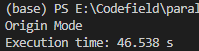
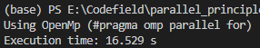
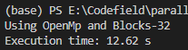

# HUST-2023春 并行编程与实践

## [任务一](./task1/task1.cpp) 使用OpenMP进行并行矩阵乘法

### TASK
- 你的程序应该能够接受两个矩阵作为输入，并计算它们的乘积。
- 使用OpenMP将矩阵乘法操作并行化，以加快计算速度。
- 考虑如何将矩阵数据进行划分和分配给不同的线程，以实现并行计算。
- 考虑如何处理并行区域的同步，以避免竞态条件和数据一致性问题。
- 考虑如何利用OpenMP的并行循环和矩阵计算指令，以进一步提高并行效率。

### BUGS
出现链接错误`undefined reference to 'omp_get_wtime'`是因为没有链接OpenMP库，在编译命令中添加-fopenmp选项即可，命令如下。
```bash
# 添加选项
g++ -fopenmp task1.cpp -o task1

# 命令行
cd "e:\Codefield\parallel_principle_labs_hust\task1\" ;
if ($?) { g++ -fopenmp task1.cpp -o task1 } ; if ($?) { .\task1 }
```

### LOGS
随机生成不同大小的数据集，这里分别生成了1k~4k，步长=0.5k的数据集，对于每个数据集，分别跑了三个实验，具体方案如下面的 step1 ~ step3 所示。

【实验结果汇总表】

时间单位为秒(s)，这里为了放大观察，都将矩阵乘法执行10次。

| 数据集（矩阵）大小 |  Baseline  |   OpenMP  |   分块    |
| :--------------: | :-------: | :-------: | :-------: |
|      1k×1k      |   46.53   |   16.529  |  12.62    |
|   1.5k×1.5k     |  230.483  |   86.225  |  48.274   |
|      2k×2k      |  779.347  |  190.439  |  124.085  |
|   2.5k×2.5k     |  1414.18  |  359.067  |  223.803  |
|      3k×3k      |  2932.61  |  857.639  |  372.692  |
|   3.5k×3.5k     |  4294.26  |  1202.43  |  625.25   |
|      4k×4k      |  5558.54  |  1826.19  |  919.865  |
|   4.5k×4.5k     |  11056.7  |  2756.93  |  1256.62  |

#### Step 1
不使用任何优化的情况下，`dim=1000`的情况下计算两个矩阵乘法所花费的时间如下：



#### Step 2
加上 `#pragma omp parallel for` 指令来并行化矩阵乘法，它会让编译器将接下来的for循环并行化执行，其中每个线程将负责处理不同的迭代。而OpenMP会自动根据可用的线程数进行任务划分和分配。花费的时间如下：



#### Step 3
使用块划分的方法将矩阵划分为更小的块，块大小为32，并使用OpenMP的并行指令 `#pragma omp parallel for collapse(2)` 将计算任务分配给多个线程。花费的时间如下：




## [任务二](./task2/task2.cpp) 使用Pthreads实现并行文本搜索

### TASK
- 你需要实现一个函数，该函数接受一个目标字符串和一个包含多个文本文件的文件夹路径。
- 程序应该并行地搜索每个文本文件，查找包含目标字符串的行，并将匹配的行打印出来。
- 每个线程应该处理一个文件，你需要合理地分配文件给不同的线程。
- 确保你的程序是线程安全的，并正确处理多个线程之间的同步问题。

### LOGS
